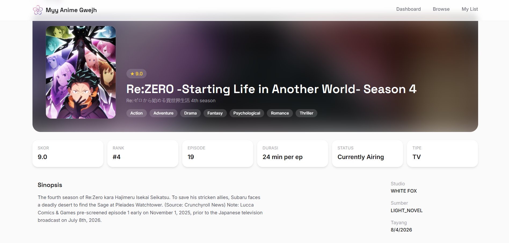

# myyAnimeGwejh

Personal anime tracker. tempat nyimpen catatan anime yang pernah ditonton, cari judul favorit, dan lihat apa yang lagi populer/tayang musim ini. Pastinya datanya realtime ygy

## Akses Web Disini

```bash
https://myy-anime-gwejh.vercel.app/
```

## Preview

### Dashboard


### Browse Anime


### Detail Anime



## Tech Stack

- [React](https://react.dev/) + [Vite](https://vite.dev/)
- [Tailwind CSS](https://tailwindcss.com/)
- [TanStack Query](https://tanstack.com/query)
- [React Router](https://reactrouter.com/)
- GraphQL API (rahasia xixixi)
- [Supabase](https://supabase.com/)

## Menjalankan Secara Lokal

```bash
npm install
npm run dev
```

## Build

```bash
npm run build
```
